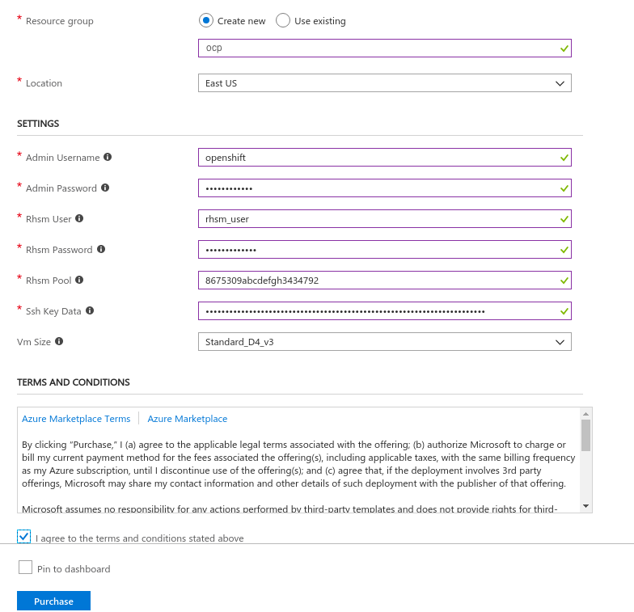

# Azure template for instantiating and deploying a standalone Red Hat JBoss EAP on OCP on Azure

**NOTE: This template creates an ephemeral instance of OpenShift Container Platform and Red Hat JBoss EAP. You are responsible for backing up any data that you want to save while using this instance**

1. Create a Single VM OpenShift deployment using the Azure Portal

------

This template deploys OpenShift Container Platform on Azure.

#### Subscription
Accept the default subscription ID value. Note: this field is not shown in the picture above.

#### Resource Group
Select "Create new" resource group if one does not currently exist. Enter "ocp" or a name of your choosing in the input field.

#### Location
The geographic location in which to deploy OpenShift Container Platform.

#### Admin User
Supply a username which will be used for SSH access,OpenShift Container Platform web console, JBoss EAP Admin .

#### Admin Password
Supply a password which will be used for the Openshift Container Platform web console.

#### Rhsm User
Red Hat user name to be used for system registration.

#### Rhsm Password
Red Hat password to be used for system registration.

#### Rhsm Pool
Subscription pool to be used for the installation. This apha-numeric value can be found under https://access.redhat.com/management/products

#### Ssh Key Data
You will need a SSH RSA public key for access if one currently does not exist on your system. Please supply your Public SSH key only. 
For example, in Linux the key can be located at ~/.ssh/id_rsa.pub. Make sure to copy and paste the **ENTIRE** contents of the file ~/.ssh/id_rsa.pub into this input field.

#### Vm Size
Specify a VM size. A default value is provided. If another size or type of vm is required ensure that the Location contains that instance type.

Once all of these values are set, then check the box to "Agree to the terms and conditions" and then click the Purchase button.

**Acknowledgements: Thanks to the following individuals for the base template: Daniel Falkner, Glenn West, Harold Wong, and Ivan McKinley**

2. Deploy OpenShift Openshift Container Platform template to Azure

A notification will pop up in the top right notifying you of the deployment:

The deployment will take about 50 minutes. Once completed, the notification will display:

Click on "Go to resource group" button in the notification above to open up the window for the origin resource group (or you can also click on the "Resource groups" under "Favorites" on the leftmost vertical Azure portal menu, and then click on "ocp" to open the ocp resource group). You will see the following:

On the top right of the origin resource group window, you will see a heading "Deployments".  Click on "1 Succeeded" under this heading to see the deployments:

Now, click on the "Microsoft.Template" link to display the contents of the template.  Then click on the "Outputs" to see the URL of the OpenShift Origin console:

At this point, copy the string from the "OPENSHIFTCONSOLE" field, open a browser window and paste the string in the Address field. If your browser warns you about the site being insecure, go ahead and continue to the insecure site.  At this point, you should see the login prompt to log in to the all-in-one OpenShift Origin cluster:

For Username and Password, the "Admin User" and "Admin Password" you supplied in the template above. Click on "Log In" and you should see:

Once you login into the Openshift Console, you shoud have a preconfigured project listed on the right hand side of the console

Click on Applications, select Deployments and from the table on the right click on dukes,select the #1 Deployment and you will be able to see the number of instances/pods that are running of the application, status, creation date,configuration, etc.

To access the webapp go to Applications and select Routes. Routes is the way Openshift Container Platform exposes services at a host name, you shoud see the url for the route.

Click on the link under "Hostname". This will open the JBoss EAP Welcome screen:
    

To access the web application dukes, append "/dukes" at the end of the URL you just opened, e.g. [ROUTE URL]/dukes.

You should see the webapp dukes. You have just installed Openshift Container Platform, Red Hat Enterprise Application Paltform and a webapp called dukes. 

